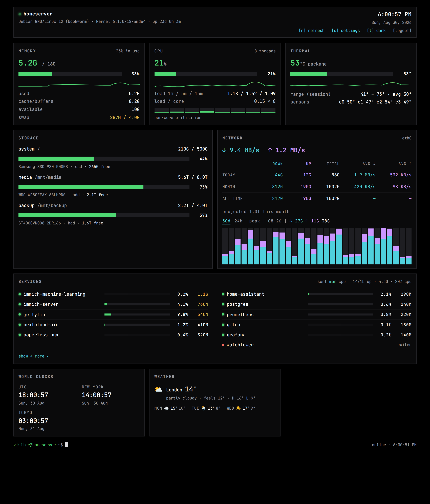

# systemdashboard

A tiny, self-hosted, terminal-styled status page for a home server:
live RAM, per-drive storage, CPU/load, temperature, vnstat network history,
Docker service status, weather and world clocks — in one HTML file.



## Design

Three small containers (~30 MB RAM total), one `docker compose up`,
**no sudo, no host packages**:

| service | image | job |
| --- | --- | --- |
| `auth`  | `node:22-alpine` (~17 MB) | login gateway on `PORT`; the only exposed port. Session cookie, per-IP lockout, whitelist. Proxies authed traffic to `web`. Serves `/__ctl/*` (refresh trigger + LAN-only container start/stop/restart/logs via the docker socket). |
| `web`   | `nginx:alpine` | serve `www/` (the static page + `data.json`); internal only |
| `agent` | `alpine` + bash (~2 MB, 22 MB for ~2 s per tick) | every `INTERVAL` seconds — or on the `.refresh` trigger — read host metrics and write `www/data.json` |

Measured idle: **~21 MiB RAM total**, CPU effectively zero (a <5% blip per
container during the agent's tick).

The agent bind-mounts the host root read-only at `/host` with **`rslave` mount
propagation** (the same trick `node_exporter` uses) so nested mounts such as
`/srv` and `/mnt/*` are visible for per-drive usage. It also mounts
`docker.sock` read-only for container status.

Data sources — all read-only, nothing installed on the host:

| metric | source |
| --- | --- |
| memory / swap | `/host/proc/meminfo` |
| cpu % + per-core + load | `/host/proc/stat` deltas (aggregate + `cpuN`), `/host/proc/loadavg` |
| trend sparklines | agent keeps the last 60 cpu/mem/temp samples (`www/.trend`) — the mem/cpu/thermal line covers the last 60 × `INTERVAL` (2 h at the default 120 s), and is drawn on first load rather than after a few polls |
| temperature   | `/host/sys/class/hwmon/*` (coretemp/k10temp…), thermal-zone fallback |
| storage       | `statvfs` per mount + model/rotational from `/host/sys/class/block` |
| network       | `vnstat --json` (totals, 30-day / 24-hour history, today/month averages) + live MB/s from `/sys/class/net/*/statistics` deltas |
| docker        | `docker ps` + `docker stats` (per-container cpu %, memory) via the mounted socket |
| weather       | [Open-Meteo](https://open-meteo.com) — browser-side, no key |
| world clocks  | browser `Intl` — browser-side |

`vnstat` must be running on the host (it already logs to `/var/lib/vnstat`).
If it isn't: `sudo apt install vnstat && sudo systemctl enable --now vnstat`.

## Setup

```sh
cp docker-compose.example.yml docker-compose.yml
cp .env.example .env                        # set AUTH_PASS (required), PORT, TZ, NET_IFACE, DISKS
cp www/config.example.json www/config.json  # title, weather, clocks, drive labels, portainerUrl
docker compose up -d --build
```

Open `http://<host>:<PORT>` (default `20002`) and log in.

`docker-compose.yml`, `.env` and `www/config.json` are git-ignored — the
`*.example` files are the templates, so your edits stay local and never
land in a commit.

To expose it through an existing reverse proxy / Cloudflare tunnel, point a
hostname at `http://localhost:<PORT>`. The tunnel's `Cf-Connecting-Ip` /
`X-Forwarded-For` header is used for the real client IP (only when
`TRUST_PROXY=1`), so lockout works for public visitors. When a local proxy
is the only thing that should reach the gateway, set `BIND_ADDR=127.0.0.1`
in `.env` so the port isn't exposed on the LAN — otherwise a client on the
same network could send a forged IP header and skip the lockout.

## Authentication & lockout

The `auth` gateway is the only thing listening on `PORT`; `web` has no
published port.

| env | default | meaning |
| --- | --- | --- |
| `AUTH_USER` / `AUTH_PASS` | — | credentials (or `AUTH_PASS_HASH` = sha256 hex) |
| `MAX_FAILS` | `3` | failed logins from one IP before it is blocked |
| `BAN_HOURS` | `0` | block duration; `0` = permanent until unbanned |
| `SESSION_HOURS` | `720` | login session lifetime (30 days) |
| `WHITELIST` | private ranges | IPs/CIDRs that are never blocked and skip fail tracking |
| `TRUST_PROXY` | `1` | trust `Cf-Connecting-Ip` / `X-Forwarded-For` for the client IP |
| `BIND_ADDR` | `0.0.0.0` | host address the port binds to; `127.0.0.1` to keep it off the LAN |

Private ranges (`10/8`, `172.16/12`, `192.168/16`, loopback) are whitelisted
by default, so **LAN access can never be locked out** — only public visitors
through the tunnel can trip the block.

State lives in `./data/` (git-ignored), re-read on every request:

```sh
bin/bans                     # list blocked IPs + the whitelist
bin/unban 203.0.113.7        # remove a block (takes effect immediately)
bin/whitelist 203.0.113.7    # never block this IP/CIDR again (also unbans)
```

`data/whitelist.txt` can also be edited directly — one IP or CIDR per line.

## Configuration

The **settings panel** (press `s`) edits everything live:

- **name & icon** — the browser-tab title, and a favicon (upload a PNG/SVG,
  or type an emoji)
- **panels** — drag to reorder, per-panel size (`normal` / `wide` / `full`
  columns), show/hide
- weather locations, world clocks, refresh interval, per-drive labels

**Save** writes `www/config.json` via the auth gateway
(`POST /__ctl/config`), so every viewer sees the same layout and icon. If
that endpoint isn't reachable it falls back to this browser's
`localStorage`, and "export json" prints the config to paste in by hand.

`www/config.json` is git-ignored; ship-time defaults live in
`www/config.example.json`.

Per-drive labels and warnings:

```json
"disks": {
  "/srv": { "label": "media", "warn": "aging drive - ATA errors logged" }
}
```

Per-drive labels and warnings:

```json
"disks": {
  "/srv": { "label": "media", "warn": "aging drive - ATA errors logged" }
}
```

## Keys

| key | action |
| --- | --- |
| `r` | refresh now |
| `s` | open / close settings |
| `t` | toggle theme: dark ⇄ light |
| `esc` | close settings |

`[logout]` in the header ends the session. The font (JetBrains Mono) is
self-hosted under `www/fonts/`, so it renders identically offline.
`prefers-reduced-motion` disables the blink/pulse animations.

**Colour** encodes health, not decoration: meters and the big numbers run
green → amber → red by threshold (memory, cpu, temp, load, swap, per drive,
per container). Download is cyan, upload is magenta, used consistently on
the network rate, totals, averages and the 30-day bars.

**Services** is a responsive multi-column list (CSS columns, fills
top-to-bottom), sorted by memory or cpu (`mem·cpu` toggle in the header).
It shows the top 10 with a "show N more" expander; stopped/created
containers are always shown regardless of the cap. Each row has
`⟳` restart · `◼`/`▶` stop/start · `↗` open in Portainer · `≡` logs —
**visible only to whitelisted (LAN) clients** (`CTL_LAN_ONLY`); tunnel
visitors get a read-only view. Stop asks for confirmation. The Portainer
link needs `portainerUrl` in `config.json`.

Storage and network sit side by side; network's today / month / all-time
figures are an aligned table (down · up · total · avg↓ · avg↑), with a
`30d` / `24h` bar history below it (hover a bar for its down/up).

**`r` / refresh** POSTs `/__ctl/refresh`, which drops a `.refresh` file the
agent watches — it wakes from its sleep, samples immediately, and the UI
polls until the new snapshot lands. So `r` gets genuinely fresh data
despite the 120 s interval.

**Refresh:** the agent regenerates `data.json` every `INTERVAL` seconds
(default 120) and the UI polls at `refreshSec` (default 120). The live
network rate is therefore an ~`INTERVAL`-second average. Press `r` or lower
both for a snappier feel.

## Layout

```
systemdashboard/
├── docker-compose.example.yml   # → docker-compose.yml (gitignored)
├── .env.example                 # → .env (gitignored)
├── nginx.conf
├── auth/
│   ├── Dockerfile
│   └── server.js           # the whole login gateway (zero deps)
├── collector/
│   ├── Dockerfile
│   └── collect.sh          # the whole agent
├── bin/
│   ├── bans · unban · whitelist
├── data/                   # bans.json, whitelist.txt, secret (gitignored)
└── www/
    ├── index.html          # the whole UI
    ├── config.example.json # copy to config.json (gitignored) and edit
    ├── fonts/              # self-hosted JetBrains Mono (woff2, latin subset)
    └── data.json           # generated by the agent (gitignored)
```
